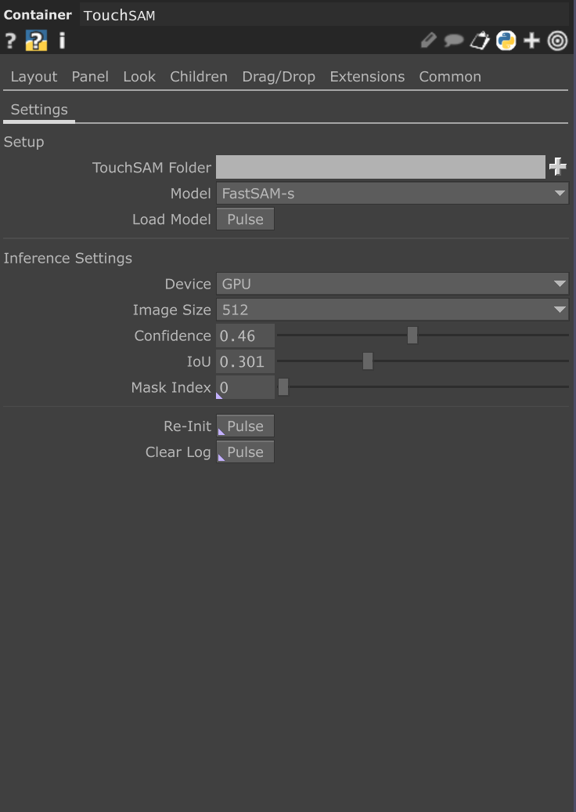

# TouchSAM
## 🎨 Overview
The FastSAM TouchDesigner Plugin is a .tox component that integrates real-time segmentation into TouchDesigner using the [FastSAM model](https://docs.ultralytics.com/models/fast-sam/).

## Requirements (manual setup)
> [!WARNING]
> This is for advanced users only as it requires installing CUDA and the Python virtual environment from scratch.

<details>
  <summary>Manual setup</summary>

  1. Install Python [3.11.1](https://www.python.org/downloads/release/python-3111/)
  2. Install [CUDA Toolkit](https://developer.nvidia.com/cuda-11-8-0-download-archive) 11.8
  3. Install the required packages
  ```bash
  pip install torch torchvision torchaudio --index-url https://download.pytorch.org/whl/cu118 ultralytics
  ```
  4. Proceed with the `Installation` steps
</details>

## 🚀 Installation
1. Open `setup.bat` with text editor and set path to Python 3.11 in `set PYTHON_PATH=` (ex. `set PYTHON_PATH="C:\Program Files\Python311\python.exe"`).
2. Run `setup.bat`.
> [!NOTE]
> You can skip points 1. and 2. if you followed the `manual setup` steps.
3. **Download** the `.tox` file from the [GitHub Releases](https://github.com/nicola-corbellini/TouchSAM/releases).
4. **Drag & Drop** the `.tox` file into your TouchDesigner project.
5. **Save and Restart** TouchDesigner project.
6. **Load the model** (the first time it will download it automatically in the plugin folder).

## Inputs & Outputs

### Inputs:
- Image or video (TOP): input image or video to segment (e.g. from a `Movie File In TOP`)
### Outputs:
- Segmented image (TOP): processed image with segmentation masks applied.
- Mask image (TOP): black and white specified mask.
- Result table (DAT): comprehensive table with resulting segmentation masks' properties. E.g.:

| id | confidence | center_x | center_y | x1  | y1    |   x2  |   y2  | width | height |  area    |
|----|------------|----------|----------|-----|-------|-------|-------|-------|--------|----------|
| 5  | 0.601      | 256.0    | 280.9    | 0.0 | 143.9 | 512.0 | 418.0 | 512.0 | 274.1  | 140350.6 |
| 3  | 0.688      | 256.0    | 234.7    | 0.0 | 144.9 | 512.0 | 324.6 | 512.0 | 179.8  | 92042.8  |
| 1  | 0.932      | 256.0    | 77.3     | 0.0 | 0.0   | 512.0 | 154.5 | 512.0 | 154.5  | 79112.5  |

- Logs table (DAT): table with Python logs storing errors and messages from the Python console.

## Usage
To perform the segmentation on a image/video, it is enough to press `Load Model` and inference starts.
> [!NOTE]
> TouchDesigner may freeze for a moment, while loading the model.
### Parameters
<p align="center">

</p>

- **Venvpath**: path pointing to the Python virtual environment with pre-installed packages (this is set automatically to the project folder if not changed)
- **Model**: version of the FastSAM model
- **Load Model**: load model into memory
- **Device**: device used for inference (GPU recommended for real-time performance on videos)
- **Image Size**: size to which the image is resized before inference
- **Confidence**: minimum confidence threshold for detection. Objects detected with confidence below this threshold will be disregarded. Adjusting this value can help reduce false positives.
- **IoU**: Intersection Over Union threshold for Non-Maximum Suppression (NMS). Lower values result in fewer detections by eliminating overlapping boxes, useful for reducing duplicates.
- **Mask index**: index of the mask specific mask to extract.
- **Re-Init**: reload the Python extension.
- **Clear Log**: clear the log DAT.

## Roadmap
- [ ] Implement prompting modalities (i.e., points, boxes and text)
- [ ] Add support for other models (e.g., MobileSAM, SAM2)
- [ ] Add support for [TopArray](https://github.com/IntentDev/TopArray) interface to improve performance
